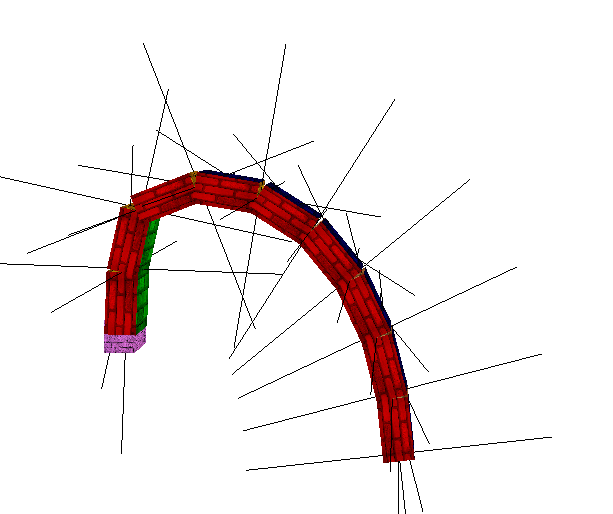
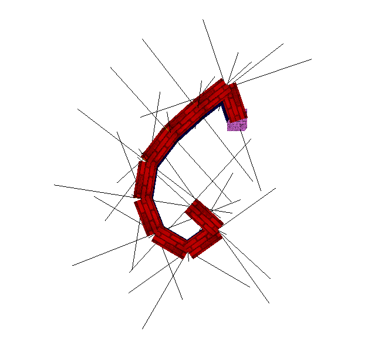
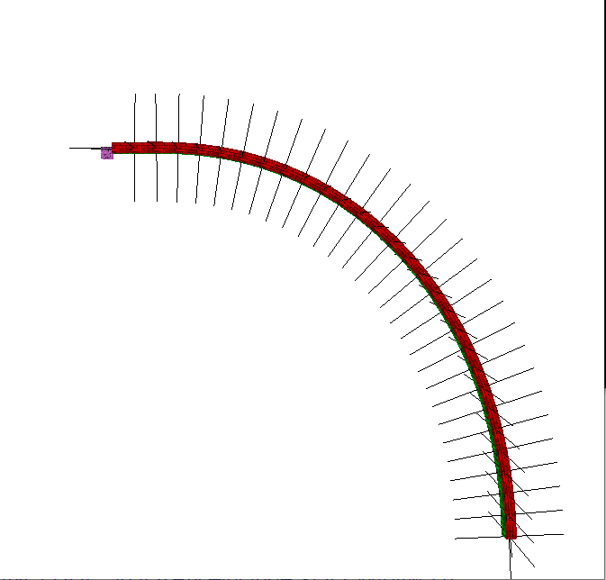
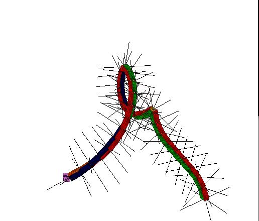

# IKSolver
CCD Algorithm for Solving Inverse Kinematics Problem in C++ with openGL.

Implememented a chain of links, that can be moved and rotated freely with the user's input and can use the CCD algorithm to reach the target.

## Project structure:

### engine
*This is the under-the-hood part that enables rendering meshes.*
- mesh.cpp
  - *Mesh represention via openGL.*
- shader.cpp
  - *Shader manager, with the ability to load and bind multiple textures.*
- obj_lodaer.cpp
  - *.obj File parser.*

### IKSolver
*The actual IKSolver implementation.*
- main.cpp
  - *Entry point.*
- IKSolver.cpp
  - *IKSolver manager.*
- Cube.cpp 
  - *Cube represention.*
- SceneData.cpp 
  - *Scene represention.*
- InputHandler.cpp
  - *User input handler.*
- display.cpp
  - *glfw Window wrapper.*
- Config.cpp
  - *Cross project configurations.*
  
##  Usage:
**Esc** - Exit the program.

**Mouse click**
 - Set current selected object, link part / target / background.
 - Used color picking to calulate the selected object.

**Mouse right drag**
 - Drag the currently selected (chain / target / non selected - scene) under the mouse's position.

**Mouse left drag**
 - Rotations on the currently selected according to draggings. If a link in the chain was selected then rotate it, otherwise rotate the scene.

**Mouse scroller**
 - Zooms in and out of the currently selected (target, chain or scene).
 
**Arrows**
 - Rotations on the currently selected according to draggings. If a link in the chain was selected then rotate it, otherwise rotate the scene.

**Space**
 - Stop / Start the CCD algorithm for the chain to reach the target. Once a target is reached, it's distance (< threshold) from the target is printed.
 - If the target is out of reach then we output "cannot reach".

## Future Possible Upgrades
- Solve with other algorithms such as FABRIK and The Jacobian inverse technique.
- Ray picking in addition to the color picking.

##  Images:

